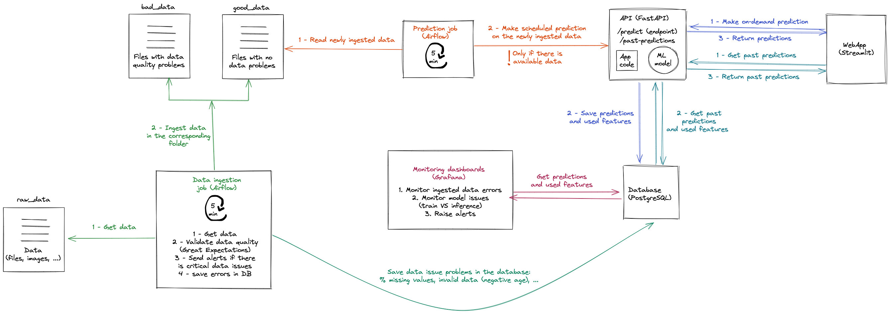

# DSP_Final
Final_Project_Black_Friday
## About
This project is used for predicting the purchase on the given blackfriday dataset. The main parts of the project are:

* Airflow
* Postgres
* Streamlit
* FastAPI
* Grafana


## Authors
* Zihang(Eric) WANG
* Jimy SALEM
* Liyang FANG
* Rohithvishwa Vimalraj sangeethapriya

## Architecture

## Install
**Intall project requirements**

`pip install -r requirements.txt`

**Intall Black Friday Databse**
https://www.kaggle.com/datasets/sdolezel/black-friday

**Intall Postgresql database**

for mac users:

`brew install postgresql@14`

or:

https://www.postgresql.org/download/

**Intall Grafana**

for mac users:

`brew install grafana`

or:

https://grafana.com/get/

## Run
**Go to the root of project**
`cd \the\prject\path`

**Run Postgresql database**

`psql blackfriday`

**Run Fastapi**

`uvicorn api.main:app`

**Run webapp**

`streamlit run pages/main.py`

**Run Airflow**
```
export AIRFLOW_HOME=${PWD}/airflow
airflow scheduler
airflow webserver
```

**Run Grafana**

for mac users:
```
brew services run postgresql@14
brew services run grafana
```
